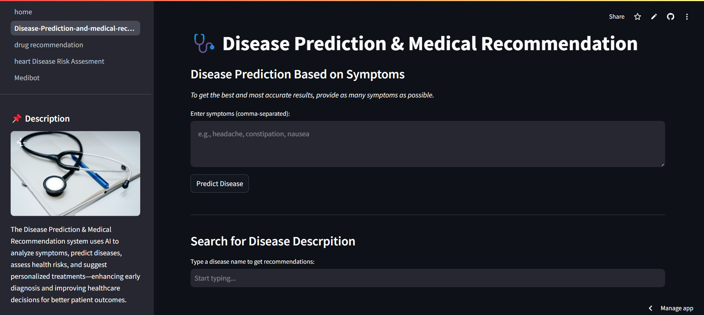
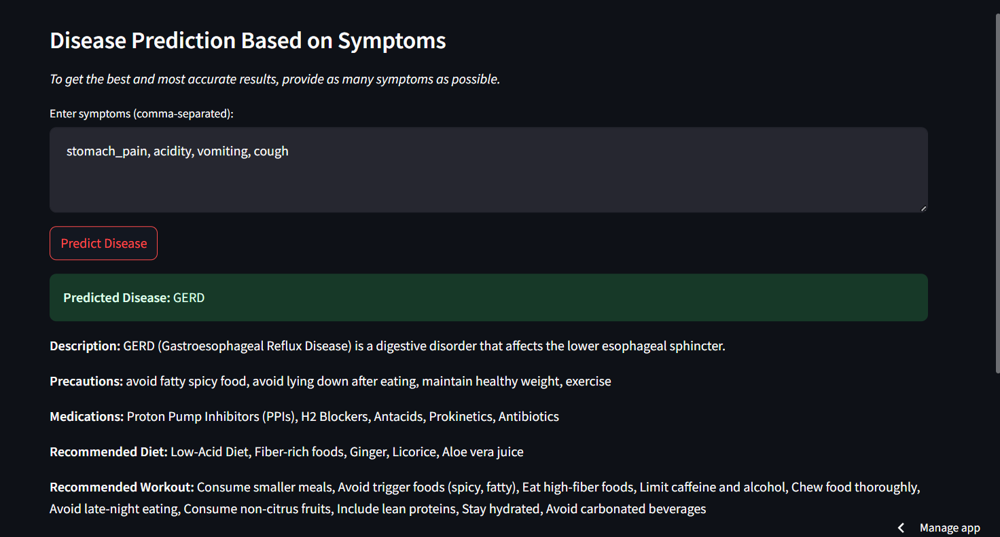
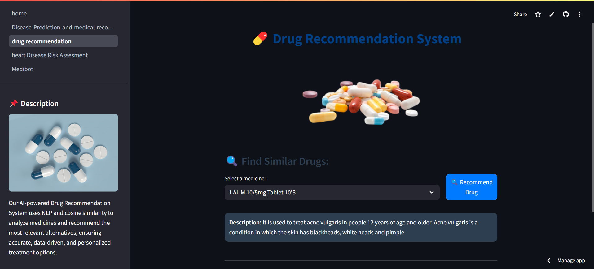
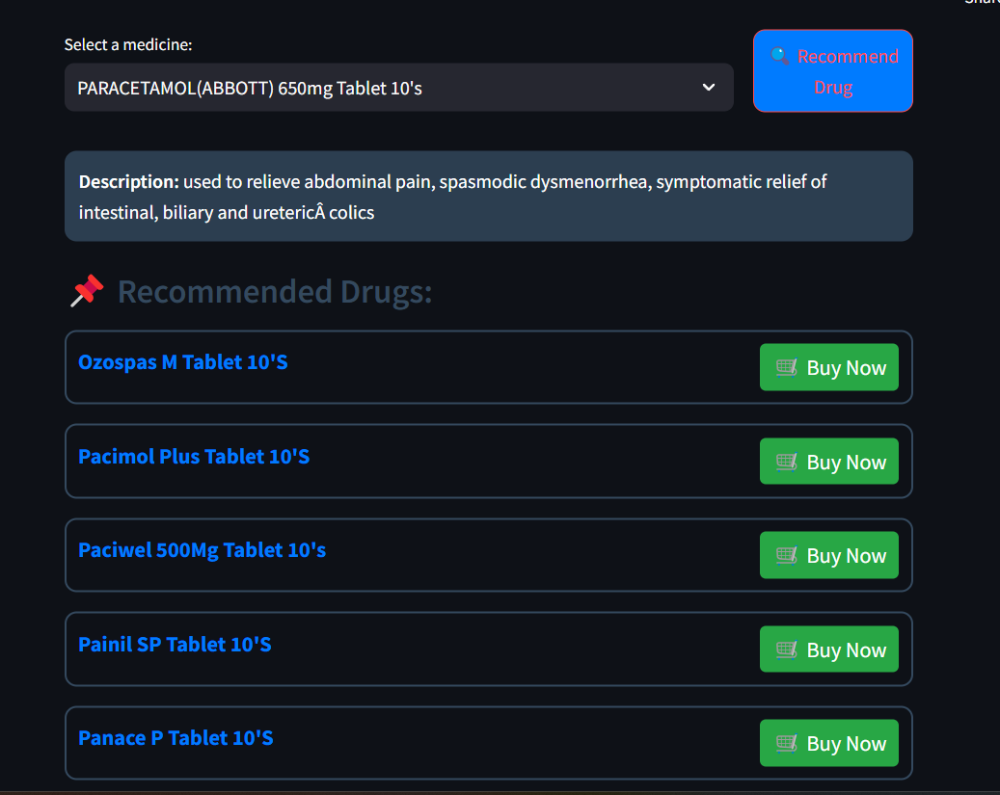
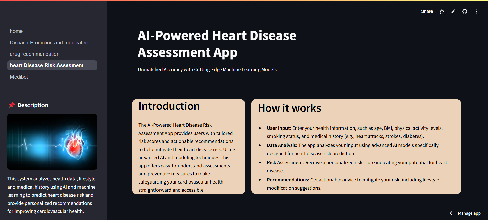
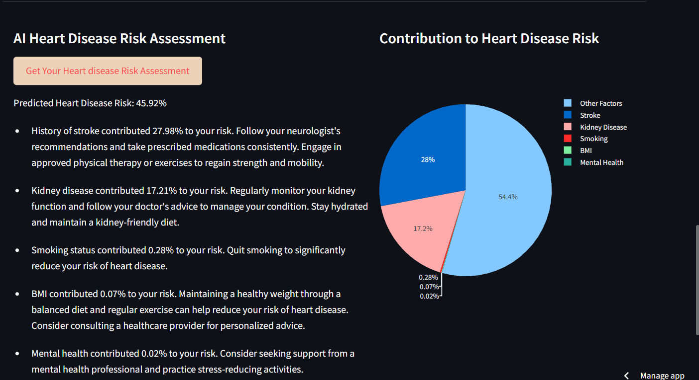
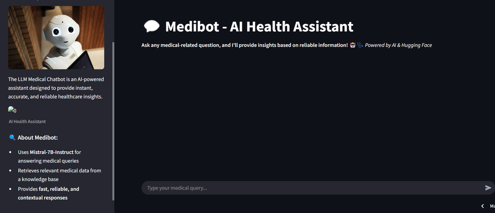
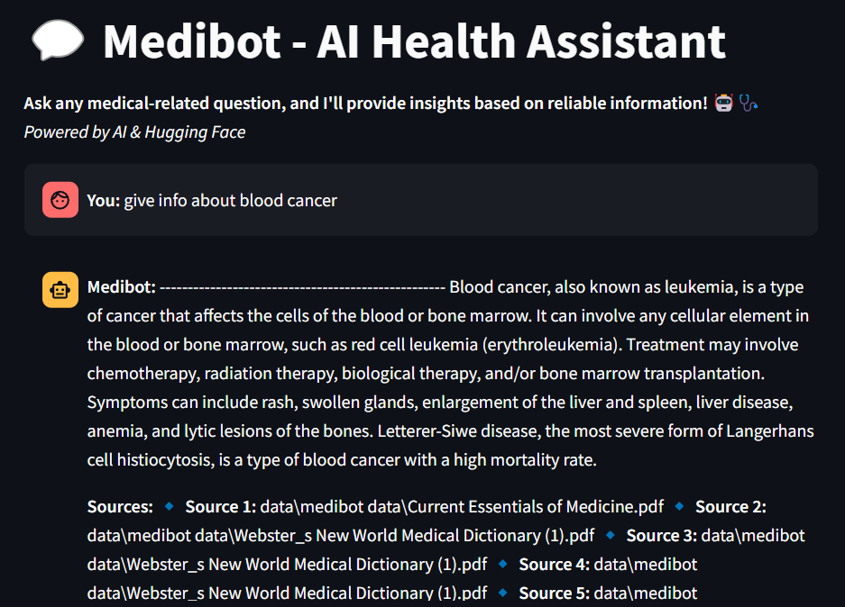

<h1 align="center">🩺 AI-Powered Healthcare Intelligence Network</h1>

  <strong>Revolutionizing Healthcare with AI-Driven Predictions, Recommendations, and Insights, Medibot(RAG)</strong>
   
  
  

---

<h2>📌 About This Project</h2>

  The <strong>AI-Powered Healthcare Intelligence Network</strong> is a cutting-edge platform that leverages Machine Learning (ML) and Natural Language Processing (NLP) to provide 
  accurate disease predictions, personalized medical recommendations, and AI-assisted drug suggestions. The system aims to enhance early diagnosis, reduce medical errors, and 
  offer intelligent healthcare solutions.

https://github.com/user-attachments/assets/360876dc-551a-498b-ab75-472137fed751

<h2>🚀 Features</h2>

<h3>💡 Disease Prediction & Medical Recommendation</h3>

  This module uses <strong>Machine Learning</strong> to predict diseases based on symptoms and suggest the best medical recommendations.

<ul>
  <li>✅ Predicts diseases based on symptoms provided by the user.</li>
  <li>✅ Uses <strong>RandomForest Classifier</strong> for predictions.</li>
  <li>✅ Provides recommended treatments and precautions.</li>
  <li>✅ Provides medical descriptions, precautions, medication suggestions, and diet recommendations**.</li>
</ul>

|  |  |
|---------------------------------|---------------------------------|

<h3>💊 AI-Powered Drug Recommendation</h3>

  Our AI system uses <strong>NLP & Cosine Similarity</strong> to recommend alternative medicines based on drug properties.

<ul>
  <li>✅ AI-powered alternative medicine finder.</li>
   <li>✅Utilizes **NLP & cosine similarity** for **accurate drug matching**</li>
  <li>✅ Matches medicines with similar ingredients.</li>
  <li>✅ Ensures safer and more effective drug prescriptions.</li>
</ul>

|  |  |
|---------------------------------|---------------------------------|

<h3>🪀 Heart Disease Risk Assessment</h3>

  This module uses <strong>LightGBM & AI classifiers</strong> to assess heart disease risks based on patient history.

<ul>
  <li>✅ Evaluates heart disease risk based on lifestyle and medical history.</li>
  <li>✅ Uses machine learning models (LightGBM, EasyEnsemble) for predicting heart disease risk.  </li>
  <li>✅ Takes inputs like age, BMI, smoking habits, medical history, etc.</li>
  <li>✅ Provides a **personalized heart risk score with AI-driven recommendations**</li>
</ul>

|  |  |
|---------------------------------|---------------------------------|

<h3>🤖 Medibot - AI Health Assistant</h3>

  Our <strong>LLM-powered chatbot</strong> answers medical queries and provides instant healthcare insights using <strong>Hugging Face LLM (Mistral-7B-Instruct)</strong>.

<ul>
  <li>✅ AI-powered medical chatbot based on Mistral-7B-Instruct.</li>
  <li>✅ Retrieves medical information from a FAISS vector database.</li>
  <li>✅ Retrieves reliable medical information using RAG (Retrieval Augmented Generation.</li>
  <li>✅ Provides fast, relevant, and fact-based healthcare responses.</li>
  <li>✅ Provides <strong>reliable AI-driven</strong> answers to health-related questions.</li>
</ul>

|  |  |
|---------------------------------|---------------------------------|

---

<h2>📂 Folder Structure</h2>
<pre>
📦 AI-Powered Healthcare Intelligence Network
│── 📂 models/                         # Trained ML models
│── 📂 data/                           # Medical datasets (CSV)
│── 📂 vectorstore/db_faiss/           # FAISS vector database
│── 📂 utils/                          # Images, styles, and helper files
│── 📂 pages/                          # Individual module pages
│── 📜 home.py                         # Main homepage (Streamlit UI)
│── 📜 requirements.txt                 # Dependencies
│── 📜 README.md                        # Project Documentation
│── 📜 .gitignore                        # Ignored files
│── 📜 styles.css                        # Custom CSS for UI
</pre>

---

<h2>⚙️ Installation & Setup</h2>

<h3>1️⃣ Clone the Repository</h3>
<pre>
git clone https://github.com/AbhaySingh71/AI-Powered-Healthcare-Intelligence-System.git
cd AI-Powered-Healthcare-Intelligence-System
</pre>

<h3>2️⃣ Set Up the Virtual Environment</h3>
<pre>
python -m venv venv
source venv/bin/activate  # On macOS/Linux
venv\Scripts\activate  # On Windows
</pre>

<h3>3️⃣ Install Dependencies</h3>
<pre>
pip install -r requirements.txt
</pre>

<h3>4️⃣ Set Up Environment Variables</h3>

Create a <code>.env</code> file and add:

<pre>
HF_TOKEN=your_huggingface_api_token
</pre>

Ensure it is added to GitHub Secrets when deploying.

<h3>5️⃣ Run the Application</h3>
<pre>
streamlit run home.py
</pre>

---

<h2>🚀 Deployment on Streamlit Cloud</h2>
<h3>1️⃣ Push code to GitHub</h3>
<pre>
git add .
git commit -m "Initial commit"
git push origin main
</pre>

<h3>2️⃣ Deploy on Streamlit</h3>
<ul>
  <li>Go to <a href="https://share.streamlit.io/">Streamlit Cloud</a> → Deploy a new app.</li>
  <li>Set <code>HF_TOKEN</code> in Streamlit Secrets.</li>
  <li>Click <strong>Deploy!</strong> 🎉</li>
</ul>

---

<h2>⚙️ Technologies Used</h2>
<ul>
  <li><strong>Machine Learning:</strong> RandomForest, LightGBM, NLP, Cosine Similarity</li>
  <li><strong>AI & NLP:</strong> Hugging Face Transformers, LangChain, FAISS</li>
  <li><strong>Data Handling:</strong> Pandas, NumPy, Pickle</li>
  <li><strong>Web Framework:</strong> Streamlit</li>
  <li><strong>Visualization:</strong> Plotly, SHAP for feature importance</li>
  <li><strong>Cloud Deployment:</strong> AWS, GCP</li>
</ul>

---

<h2>🔍 Why Use This App?</h2>
<ul>
  <li>🏥 <strong>AI-Powered Healthcare Insights:</strong> Get data-driven medical predictions.</li>
  <li>⚕️ <strong>Enhances Patient Care:</strong> Supports doctors and patients in making informed decisions.</li>
  <li>💡 <strong>Real-Time Recommendations:</strong> Provides immediate AI-assisted insights.</li>
  <li>⏳ <strong>Saves Time:</strong> Automates diagnosis and medical recommendations.</li>
  <li>🔬 <strong>Empowers Medical Research:</strong> Helps in early disease detection and prevention.</li>
</ul>

---

<h2>📜 License</h2>

  This project is licensed under the <strong>MIT License</strong>. Feel free to use, modify, and contribute!

---

<h2>📬 Contact Us</h2>

Have questions or need support? Reach out to us at:

<ul>
  <li>📧 <a href="mailto:abhaysingh71711@gmail.com">abhaysingh71711@gmail.com</a></li>
</ul>

---

<h2>🌐 Connect With Me</h2>

  <a href="https://linkedin.com/in/celyne-kydd" target="_blank">🔗 LinkedIn</a> 

